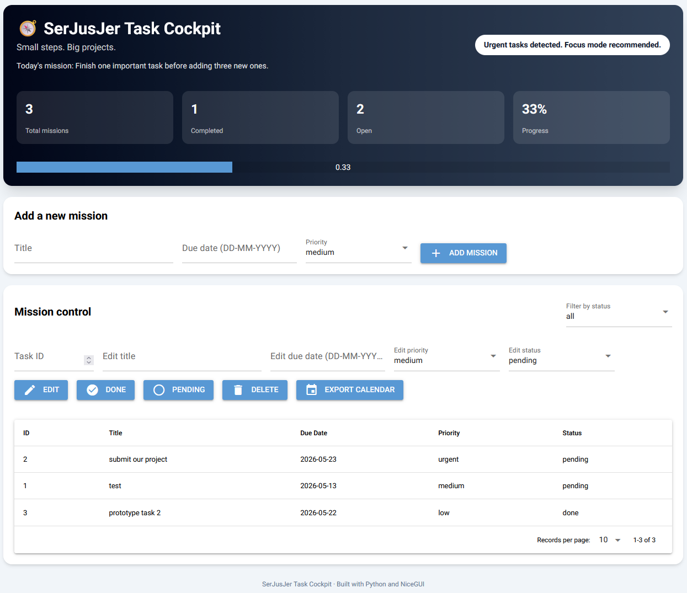

# SerJusJer Task Cockpit - To-Do Web App

A browser-based task management application developed for the **Advanced Programming** module at FHNW.

SerJusJer Task Cockpit is a Python web application for creating, organizing, filtering, updating, and tracking personal tasks. The project is based on an earlier command-line to-do application and migrates it into a browser-based application with a graphical user interface, server-side application logic, and persistent database storage.

---

## Table of Contents

- [Project Overview](#project-overview)
- [Problem Statement](#problem-statement)
- [Target Users](#target-users)
- [Scenario](#scenario)
- [Features](#features)
- [User Stories](#user-stories)
- [Use Cases](#use-cases)
- [Architecture](#architecture)
- [Project Structure](#project-structure)
- [Data Model](#data-model)
- [ER Model](#er-model)
- [Technology Stack](#technology-stack)
- [Design Patterns](#design-patterns)
- [Installation](#installation)
- [How to Run the Application](#how-to-run-the-application)
- [Testing](#testing)
- [Input Validation](#input-validation)
- [Error Handling](#error-handling)
- [Screenshots](#screenshots)
- [Wireframes](#wireframes)
- [UML Class Diagram](#uml-class-diagram)
- [Known Limitations](#known-limitations)
- [Team and Work Distribution](#team-and-work-distribution)
- [Project Management](#project-management)
- [Development Roadmap](#development-roadmap)
- [Final Presentation Preparation](#final-presentation-preparation)
- [How This Project Meets the Module Requirements](#how-this-project-meets-the-module-requirements)
- [Future Improvements](#future-improvements)
- [Authors](#authors)
- [License](#license)

---

## Project Overview

The goal of this project is to develop a browser-based task management application using Python, NiceGUI, SQLite, and SQLModel.

The application allows users to manage daily tasks in a simple and structured way. Tasks can be created with a title, due date, priority, and status. The user can view tasks in a browser-based dashboard, filter tasks, update task status, edit task information, delete tasks, and export tasks with due dates to a calendar file.

The project follows the requirements of the Advanced Programming module:

- Browser-based application instead of a CLI-only application
- NiceGUI as frontend technology
- Server-side Python application logic
- SQLite database for persistent data storage
- ORM-based data access using SQLModel
- Object-oriented structure
- Automated and documented tests
- GitHub-based collaboration

---

## Problem Statement

Many students and working professionals manage tasks across different tools, messages, or memory. This often leads to forgotten deadlines, unclear priorities, and inefficient planning.

SerJusJer Task Cockpit solves this problem by providing a simple task dashboard where tasks can be collected, prioritized, tracked, completed, and exported in one place.

The application focuses on clarity and usability rather than feature overload. The user should immediately see what needs to be done, what is already completed, and which tasks are important.

---

## Target Users

The application is designed for:

- Students managing assignments, exams, and project work
- Small project teams tracking simple tasks
- Individuals who want a lightweight personal task manager
- Users who prefer a browser-based interface over command-line tools

---

## Scenario

A student opens SerJusJer Task Cockpit in the browser before starting a study session.

First, the student adds several tasks, such as preparing a presentation, writing test cases, and reviewing the project README. For each task, the student enters a title, an optional due date and a priority.

The dashboard displays the tasks. The student filters the list to show only pending tasks and focuses on the high-priority ones. After finishing a task, the student marks it as done. The application updates the task status and stores the change in the SQLite database, so the information is still available after restarting the application.

If the student wants to use the tasks in a calendar application, tasks with valid due dates can be exported as an `.ics` calendar file.

---

## Features

### Implemented Core Features

- Create new tasks
- Store tasks persistently in an SQLite database
- Display tasks in a browser-based NiceGUI interface
- Assign task priorities
- Assign task status: `pending` or `done`
- Mark tasks as completed
- Mark completed tasks as pending again
- Edit existing tasks
- Delete tasks
- Filter tasks
- Sort tasks
- View task statistics in a dashboard
- Validate user input before saving tasks
- Export tasks with due dates to an `.ics` calendar file
- Automated tests for service logic and calendar export behavior

### Planned or Optional Improvements

- Add user login or simple user storage
- Add task categories and tags
- Add recurring tasks
- Add a full calendar view inside the app
- Add CSV or PDF export
- Add deployment support with Docker
- Add GitHub Actions for automated test execution

---

## User Stories

### US_001 – Add a Task

As a user, I want to create a new task with a title, due date, and priority, so that I can remember what needs to be done.

### US_002 – View All Tasks

As a user, I want to see all my tasks in one overview, so that I can understand my current workload.

### US_003 – Mark a Task as Done

As a user, I want to mark a task as done, so that I can track my progress.

### US_004 – Filter Tasks by Status

As a user, I want to filter tasks by status, so that I can focus only on pending or completed tasks.

### US_005 – Delete a Task

As a user, I want to delete tasks that are no longer relevant, so that my task list stays clean.

### US_006 – Persist Tasks

As a user, I want my tasks to be saved automatically, so that they are still available after restarting the application.

### US_007 – View Task Statistics

As a user, I want to see simple statistics about my tasks, so that I can quickly understand how many tasks are open, completed, or high priority.

### US_008 – Export Tasks to Calendar

As a user, I want to export tasks with due dates to a calendar file, so that I can use them in an external calendar application.

---

## Use Cases

### UC_001 – Create Task

**Actor:** User  
**Precondition:** The application is running in the browser.

**Main Flow:**

1. The user enters a task title.
2. The user optionally enters a due date.
3. The user selects a priority.
4. The user clicks the button to add the task.
5. The system validates the input.
6. The system stores the task in the database.
7. The system refreshes the task list.

**Expected Result:**  
A new pending task appears in the task overview.

---

### UC_002 – View Task List

**Actor:** User  
**Precondition:** The application is running.

**Main Flow:**

1. The user opens the application.
2. The system loads all tasks from the database.
3. The system displays the tasks in the GUI.

**Expected Result:**  
The user sees all stored tasks or an empty task list.

---

### UC_003 – Complete Task

**Actor:** User  
**Precondition:** At least one pending task exists.

**Main Flow:**

1. The user selects a pending task.
2. The user triggers the complete action.
3. The system updates the task status to `done`.
4. The system saves the change in the database.
5. The system refreshes the task overview.

**Expected Result:**  
The task is shown as completed.

---

### UC_004 – Set Task Back to Pending

**Actor:** User  
**Precondition:** At least one completed task exists.

**Main Flow:**

1. The user selects a completed task.
2. The user triggers the pending action.
3. The system updates the task status to `pending`.
4. The system saves the change in the database.
5. The system refreshes the task overview.

**Expected Result:**  
The task is shown as pending again.

---

### UC_005 – Delete Task

**Actor:** User  
**Precondition:** At least one task exists.

**Main Flow:**

1. The user selects a task.
2. The user triggers the delete action.
3. The system removes the task from the database.
4. The system refreshes the task list.

**Expected Result:**  
The deleted task no longer appears in the task overview.

---

### UC_006 – Filter Tasks

**Actor:** User  
**Precondition:** Tasks exist in the database.

**Main Flow:**

1. The user selects a filter term.
2. The system filters the available tasks.
3. The system updates the visible task list.

**Expected Result:**  
Only tasks matching the selected filter are displayed.

---

### UC_007 – Export Tasks to Calendar

**Actor:** User  
**Precondition:** At least one task with a valid due date exists.

**Main Flow:**

1. The user triggers the calendar export.
2. The system selects tasks with valid due dates.
3. The system creates calendar entries.
4. The system writes the entries into an `.ics` file.

**Expected Result:**  
A calendar file is created and can be imported into a calendar application.

---

## Architecture

The application uses a simplified layered architecture that reflects the actual implementation of the project.

```text
Browser / Client
        |
        v
NiceGUI User Interface
gui.py
        |
        v
Application / Service Logic
task_services.py
        |
        v
Persistence and Domain Model
database.py
        |
        v
SQLite Database
to_do.db
```

Additional supporting functionality:

```text
calendar_export.py
Exports tasks with valid due dates to an .ics calendar file

tests/
Contains automated tests for service logic and calendar export behavior
```

### Browser / Client

The browser is used as the visual interface for the user. It displays the NiceGUI components and sends user actions, such as button clicks or input changes, back to the Python application.

The browser does not contain business logic and does not directly access the database. It acts as a thin client.

### Presentation Layer: `gui.py`

The file `gui.py` contains the NiceGUI-based user interface.

Its main responsibilities are:

- defining the visible page and UI components
- displaying task information to the user
- receiving user input
- reacting to user actions through callbacks
- calling the service functions from `task_services.py`
- refreshing the displayed task list after changes
- showing user notifications
- starting the NiceGUI web application

The UI layer coordinates user interaction but does not directly define the database model.

### Application / Service Logic Layer: `task_services.py`

The file `task_services.py` contains the main application logic of the project.

Its main responsibilities are:

- validating task input
- creating new tasks
- updating existing tasks
- deleting tasks
- marking tasks as completed
- setting completed tasks back to pending
- filtering tasks
- sorting tasks
- coordinating task-related database operations

In this project, `TaskService` acts as the central service layer. Because the project scope is relatively small, a separate DAO package was not implemented. Instead, the service layer directly works with SQLModel sessions and the `Task` model from `database.py`.

This is a simplified but understandable architecture for the size of the project.

### Persistence and Domain Layer: `database.py`

The file `database.py` defines the database model and database setup.

Its main responsibilities are:

- defining the `Task` model with SQLModel
- configuring the SQLite database connection
- creating the database tables
- providing the database engine used by the application

The `Task` class represents the main domain object of the application. It is mapped to a database table through SQLModel.

The project uses SQLite as a lightweight local database and SQLModel as Object-Relational Mapper. This means that tasks are handled as Python objects in the code while SQLModel manages the mapping to database rows.

### Calendar Export: `calendar_export.py`

The file `calendar_export.py` contains the logic for exporting tasks into an `.ics` calendar file.

Its main responsibilities are:

- selecting tasks that contain a valid due date
- creating calendar-compatible event entries
- writing these entries into an `.ics` file
- skipping tasks without a valid due date

This functionality is separated from the GUI and task service logic because exporting calendar files is a specific supporting feature.

### Application Entry Point: `main.py`

The file `main.py` is the entry point for running the application.
It imports `gui.py`, which defines the NiceGUI user interface and application pages.
After importing the GUI, `main.py` starts the NiceGUI web server with `ui.run()`.

This keeps the application startup separate from the user interface definition.

### Architectural Summary

The final implementation uses the following file responsibilities:

```text
gui.py
Presentation layer / NiceGUI user interface

task_services.py
Application logic and task operations

database.py
SQLModel task model and SQLite database setup

calendar_export.py
Calendar export functionality

main.py            
Application entry point that starts the NiceGUI server

tests/
Automated tests for service logic and export functionality
```

The project does not implement a full separate DAO package. Instead, it follows a simplified layered structure where `TaskService` combines business logic and task-related database access for the current project scope.

---

## Project Structure

Actual project structure:

```text
To_do_lsit_BIT_2026_advanced_programming/
│
├── README.md
├── requirements.txt
├── gui.py
├── main.py
├── database.py
├── task_services.py
├── calendar_export.py
│
├── tests/
│   ├── test_task_service.py
│   └── test_calendar_export.py
│
└── docs / images / additional project files
```

### File Responsibilities

| File / Folder | Responsibility |
| ------------- | -------------- |
| `gui.py` | NiceGUI user interface, page layout, callbacks, and user interaction |
| `main.py` | Application entry point that imports the GUI and starts the NiceGUI server |
| `database.py` | SQLModel `Task` model, database engine, and table creation |
| `task_services.py` | Task validation, task operations, filtering, sorting, and database interaction |
| `calendar_export.py` | Export of tasks with due dates to `.ics` calendar format |
| `tests/` | Automated tests for service logic and calendar export |
| `requirements.txt` | Python dependencies |
| `README.md` | Project documentation |

---

## Data Model

### Entity: Task

| Field | Type | Description |
| ----- | ---- | ----------- |
| `id` | `int` | Unique task identifier |
| `title` | `str` | Short task description |
| `due_date` | `str` / date-like value | Optional due date |
| `priority` | `str` | Task priority |
| `status` | `str` | Task status: `pending` or `done` |

---

## ER Model

Current simplified ER model:

```text
Task
----
id          PK
title       TEXT
due_date    TEXT
priority    TEXT
status      TEXT
```

The current version uses one central table because the project focuses on personal task management. A more complex version could add additional tables such as `Category`, `User`, or `Tag`.

Possible future extension:

```text
Category
--------
id          PK
name        TEXT

Task
----
id          PK
title       TEXT
due_date    TEXT
priority    TEXT
status      TEXT
category_id FK -> Category.id
```

---

## Technology Stack

| Technology | Purpose |
| ---------- | ------- |
| Python | Main programming language |
| NiceGUI | Browser-based user interface |
| SQLite | Local persistent database |
| SQLModel | ORM for mapping Python classes to database tables |
| SQLAlchemy | Database engine used by SQLModel |
| Pydantic | Data validation support through SQLModel |
| pytest | Automated testing framework |
| GitHub | Version control and team collaboration |

---

## Design Patterns

### Simplified Layered Architecture

The project separates responsibilities into presentation, application logic, persistence, and testing.

The implemented structure is:

```text
GUI -> Service Logic -> SQLModel Model / SQLite Database
```

This improves readability and makes the project easier to understand and test.

### MVC-Inspired Structure

The project uses an MVC-inspired structure:

- **View:** NiceGUI components in `gui.py`
- **Controller-like callbacks:** event handlers in `gui.py`
- **Model:** `Task` model in `database.py`
- **Service:** task-related business logic in `task_services.py`

This is not a full MVC framework, but the responsibilities are separated in a similar way.

### ORM Pattern

The project uses SQLModel as an Object-Relational Mapper.

This allows the application to work with Python objects instead of writing raw SQL queries manually. The `Task` class represents both a Python object and a database table.

### Facade-Like Database Setup

The database setup in `database.py` works as a small facade for persistence-related setup. It provides a central place for database engine configuration and table creation.

### DAO Consideration

A separate DAO package was considered but not implemented as a separate layer. For this project size, database access is handled inside `TaskService`. In a larger version of the project, task-specific database operations could be moved into a dedicated `task_dao.py`.

---

## Installation

### 1. Clone the Repository

```bash
git clone https://github.com/SerJay164/To_do_lsit_BIT_2026_advanced_programming.git
cd To_do_lsit_BIT_2026_advanced_programming
```

### 2. Create a Virtual Environment

Windows:

```bash
python -m venv .venv
.\.venv\Scripts\activate
```

macOS / Linux:

```bash
python3 -m venv .venv
source .venv/bin/activate
```

### 3. Install Dependencies

```bash
pip install -r requirements.txt
```

---

## How to Run the Application

The application is started with `main.py`.

```bash
python main.py
```

`main.py` imports the NiceGUI interface from `gui.py` and starts the local NiceGUI web server.

After starting the application, NiceGUI runs a local web server. The terminal shows a local URL, usually similar to:

```text
http://localhost:8080
```

---

## Testing

The project includes automated tests written with `pytest`.

The implemented test mix follows the expected structure for the Advanced Programming project:

| Test Type | Number | Purpose |
|---|---:|---|
| Unit Tests | 6 | Test isolated validation and parsing methods in the service layer |
| Database Tests | 3 | Test persistence-related CRUD behavior with a temporary SQLite database |
| Integration Tests | 3 | Test the interaction between task data and calendar export functionality |
| Total | 12 | Automated tests included in the project |

The current test files are located in the `tests/` folder:

```text
tests/
├── test_task_service.py
└── test_calendar_export.py
```

### Run All Tests

```bash
pytest
```

### Run Tests Verbosely

```bash
pytest -v
```

### Test Cases

| ID | Test Type | Description |
|---|---|---|
| TC_001 | Unit | Valid task title is stripped and accepted |
| TC_002 | Unit | Empty task title raises a validation error |
| TC_003 | Unit | Valid due date is parsed correctly |
| TC_004 | Unit | Invalid due date format raises a validation error |
| TC_005 | Unit | Valid priority value is accepted and normalized |
| TC_006 | Unit | Invalid status value raises a validation error |
| TC_007 | Database | New task is saved and persisted in the database |
| TC_008 | Database | Existing task can be edited and updated in the database |
| TC_009 | Database | Existing task can be deleted from the database |
| TC_010 | Integration | Calendar export creates an `.ics` file from stored task data |
| TC_011 | Integration | Calendar export contains the expected task information |
| TC_012 | Integration | Calendar export skips tasks without a due date |

### Testing Scope

The automated tests focus on the most important non-visual parts of the application:

- input validation in the service layer
- date parsing
- priority and status validation
- task creation, editing and deletion
- database persistence using a temporary SQLite test database
- calendar export to `.ics`

The graphical user interface itself is tested manually through the browser during development and the live demo. Full browser-based end-to-end tests with tools such as Selenium or Playwright are not included in the current project scope.

## Error Handling

The project uses validation and exception handling to avoid crashes and invalid data.

Examples:

- Empty task titles are rejected.
- Invalid due dates are handled before saving.
- Invalid priorities or statuses are rejected.
- Database operations are handled through SQLModel sessions.
- Calendar export skips tasks without valid due dates.

---

## Screenshots

The following screenshot documents the final user interface of the application.



---

## Wireframes

The planned interface follows a simple dashboard structure:

```text
+--------------------------------------------------+
| SerJusJer Task Cockpit                           |
+--------------------------------------------------+
| Add Task Form                                    |
| Title   | Due Date   | Priority   |   Add Button |
+--------------------------------------------------+
| Filters                                          |
+--------------------------------------------------+
| Task List                                        |
| Task | Due Date | Priority | Status | Actions    |
+--------------------------------------------------+
| Statistics                                       |
| Pending | Done | Total | High Priority           |
+--------------------------------------------------+
```

---

## UML Class Diagram

Simplified UML-style overview:

```text
+----------------+
| Task           |
+----------------+
| id             |
| title          |
| due_date       |
| priority       |
| status         |
+----------------+

+----------------+
| TaskService    |
+----------------+
| validate input |
| create task    |
| update task    |
| delete task    |
| filter tasks   |
| sort tasks     |
+----------------+

+--------------------+
| Calendar Export    |
+--------------------+
| export_to_ics      |
| skip invalid dates |
+--------------------+
```

---

## Known Limitations

The current version is intentionally kept simple for the module project scope.

Known limitations:

- No user login or authentication
- No multi-user support
- SQLite database is local
- No separate DAO package
- No cloud deployment
- No full calendar view inside the app
- No recurring tasks
- No category or tag system
- No role-based access control
- GUI tests are not fully automated with browser automation tools

These limitations are acceptable for the current project scope but provide clear directions for future development.

---

## Team and Work Distribution

The project was developed collaboratively by all three team members. Each member had main responsibility for specific parts of the application, while testing, debugging, code review, documentation and final quality assurance were supported as a team.

### Seraphin Schobin

Main responsibilities:

- Set up and maintained the GitHub repository structure
- Supported branch management, collaboration workflow and project cleanup
- Implemented core task logic and service-layer functions
- Set up the database structure using SQLModel and SQLite
- Connected task data with the dashboard and user interactions
- Implemented the calendar export functionality
- Supported testing, review and final debugging

### Jeremy Heer

Main responsibilities:

- Worked on input forms and user interaction flows
- Supported the visual layout and usability of the application
- Contributed to ORM-related implementation and database integration
- Supported the connection between frontend forms and backend logic
- Prepared and structured the final presentation
- Contributed to review, testing and final project refinements

### Justin Vogler

Main responsibilities:

- Developed and refined the NiceGUI-based graphical user interface
- Worked on dashboard layout, task display and visual structure
- Created and improved README documentation and project descriptions
- Wrote and supported automated tests
- Supported technical validation, debugging and error fixing
- Contributed to collaboration, presentation preparation and final quality assurance

### Shared Responsibilities

In addition to the individual responsibilities, all team members contributed to:

- GitHub collaboration and branch management
- Code reviews and merge conflict resolution
- Manual testing of the application
- Final documentation checks
- Preparation of the live demo and final presentation
- Final review of functionality, structure and project consistency

---

## Project Management

The project was managed using GitHub and regular team coordination.

### Branch Strategy

The team used branches to separate work on different parts of the application.

Examples:

- feature branches for GUI development
- feature branches for service logic
- feature branches for README and documentation
- final branch or main branch for the final submission version

Before final submission, the relevant final code should be available on the submitted GitHub branch.

### GitHub Issues

GitHub issues were used to track tasks such as:

- Implement task creation
- Implement database persistence
- Implement task filtering
- Implement calendar export
- Add automated tests
- Improve README
- Prepare final presentation
- Clean repository before submission

---

## Development Roadmap

### Completed

- Migration from CLI idea to browser-based application
- NiceGUI user interface
- SQLite database setup
- SQLModel task model
- Task creation
- Task display
- Task editing
- Task deletion
- Task status updates
- Filtering and sorting
- Calendar export
- Automated tests
- README documentation

### Planned

- Add login or user storage
- Add task categories
- Add recurring tasks
- Add a full calendar view
- Add CSV or PDF export
- Add Docker deployment
- Add GitHub Actions for automated test runs

---

## How This Project Meets the Module Requirements

| Requirement | Implementation |
| ----------- | -------------- |
| Browser-based app | Implemented with NiceGUI |
| Frontend | NiceGUI components rendered in the browser |
| Backend / server-side logic | Python logic in `gui.py` and `task_services.py` |
| Persistence | SQLite database |
| ORM | SQLModel |
| Object-oriented programming | `Task` model and `TaskService` class |
| Testing | pytest tests in `tests/` |
| Documentation | README with user stories, use cases, architecture, and test overview |
| GitHub collaboration | Repository with team contributions |

The application follows the main module idea: the browser is the user-facing client, while the application logic and data handling remain on the Python server side.

---

## Future Improvements

Possible future improvements include:

- User accounts
- User-specific task lists
- Task categories and tags
- Recurring tasks
- Full calendar view
- Export tasks to CSV or PDF
- Dark mode or theme switch
- Deployment with Docker
- GitHub Actions for automated test execution
- More advanced browser-based end-to-end tests

---

## Authors

### SerJusJer Team

- Justin Vogler
- Jeremy Heer
- Seraphin Schobin

FHNW  
BSc Business Information Technology  
Advanced Programming  
Spring Semester 2026

---

## License

This project was created for educational purposes as part of the Advanced Programming module at FHNW.